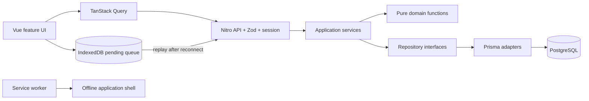

[](https://github.com/minkinad/cboost/actions/workflows/ci.yml)
[](https://nuxt.com/)

# DailyBoost

## Overview

DailyBoost is a production-oriented personal habit tracker. It combines timezone-stable scheduling, four tracking modes, deterministic analytics, goals, installable PWA delivery, reminders, and a controlled offline mutation queue. PostgreSQL is always the canonical data store; the client never becomes a hidden second source of truth.

The interface is Russian-first. Technical documentation and contracts are kept close to the code.

## Features

- Boolean, count, duration, and quantity habits.
- Daily, selected-weekday, times-per-week, and interval schedules.
- Explicit skipped entries, calculated missed entries, habit/perfect-day streaks.
- Categories, weighted goals, 7/30/90-day analytics, heatmap, weekday analysis, and deterministic weekly review.
- Multiple timezone-aware browser reminders per habit.
- Archive/restore and an idempotent legacy localStorage importer.
- Desktop and mobile layouts with accessible mutation controls.

## Screenshots

| Today | Personal analytics | Goals |
| --- | --- | --- |
| Focused daily plan with inline progress and skip actions | Weekly comparison, completion heatmap, weekday patterns, and streaks | Weighted progress calculated from linked habits |

The main portfolio flows are exercised with screenshots and traces on Playwright failures, stored in the CI artifact output.

## Architecture

DailyBoost is a modular Nuxt/Nitro monolith with explicit application and domain boundaries.



See [Architecture](docs/ARCHITECTURE.md) and [Offline sync](docs/OFFLINE_SYNC.md).

## Tech Stack

- Nuxt 4, Vue 3, Nitro, TypeScript
- PostgreSQL 17, Prisma 7
- TanStack Query, Nuxt UI, Zod
- `@vite-pwa/nuxt`, Workbox, IndexedDB
- Vitest, Nuxt Test Utils, Playwright

## Domain Model

`User` owns habits, categories, and goals. A `Habit` owns one schedule, daily entries, reminders, and optional goal links. Calendar dates are `YYYY-MM-DD` values in the user's IANA timezone. Entry status, schedule membership, streaks, completion, and analytics are canonical pure functions rather than Vue calculations.

See [Data model](docs/DATA_MODEL.md), [Habit domain](docs/HABIT_DOMAIN.md), and [Analytics](docs/ANALYTICS.md).

## Authentication

Email/password authentication uses scrypt-based password helpers and sealed HttpOnly cookie sessions. Private API routes enforce ownership server-side; cross-user IDs return 404. Auth endpoints are rate-limited, unsafe same-origin browser requests are origin-checked, and production rejects a short session secret.

See [Authentication and security](docs/AUTH.md).

## Database

PostgreSQL is the only canonical store. Committed migrations define constraints, foreign keys, and query-driven indexes. Habit entry upserts are idempotent through the unique `(habitId, date)` key.

See [Data model](docs/DATA_MODEL.md) and [Migration](docs/MIGRATION.md).

## Testing

```bash
npm run lint
npm run typecheck
npm run test
npm run build
npm run test:e2e
```

Vitest covers pure domains and application services; integration tests boot Nitro against real PostgreSQL; Playwright covers authentication, habits, analytics, goals, responsive UI, the PWA manifest, and offline replay.

## PWA / Offline

The production build emits an installable manifest, application icons, service worker, offline shell, and user-controlled update/install prompts. Offline entry actions are queued in IndexedDB, surfaced as `Saved offline`, replayed through the normal owned API, and removed only after confirmation. Authentication, habit definitions, and analytics remain online-only.

## Local Development

Requires Node.js 24.15.x and Docker.

```bash
cp .env.example .env
docker compose up -d postgres
npm ci
npm run db:migrate:deploy
npm run dev
```

Open `http://localhost:3000`. For migration authoring, use `npm run db:migrate`; for a clean sample account, register through the UI.

## Environment Variables

| Variable | Required | Purpose |
| --- | --- | --- |
| `DATABASE_URL` | yes | PostgreSQL connection string |
| `NUXT_SESSION_PASSWORD` | yes | Stable random session-sealing secret, at least 32 characters |
| `APP_ORIGIN` | production | Exact public origin used by the mutation origin check |
| `NUXT_APP_BASE_URL` | no | URL base path; defaults to `/` |
| `NITRO_PRESET` | no | Nitro deployment preset; defaults to `node-server` |

Never commit a populated `.env` or rotate the session secret without expecting all sessions to be invalidated.

## Deployment

DailyBoost requires a persistent Node server and PostgreSQL; static generation is not a supported deployment target because authenticated Nitro APIs are essential.

```bash
npm ci
npm run db:migrate:deploy
npm run build
node .output/server/index.mjs
```

Terminate TLS at the platform or reverse proxy, set `APP_ORIGIN` to the HTTPS origin, retain PostgreSQL backups, and run only one application instance unless auth rate limiting is moved to shared edge infrastructure. See [Development](docs/DEVELOPMENT.md), [API](docs/API.md), and [User guide](docs/USER_GUIDE.md).
