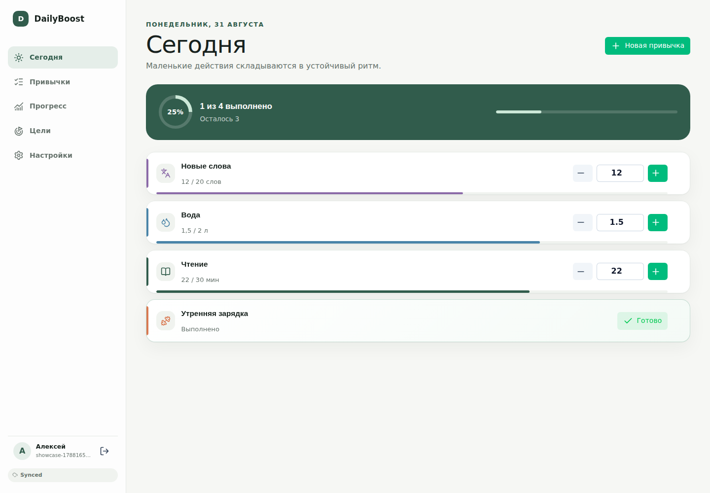
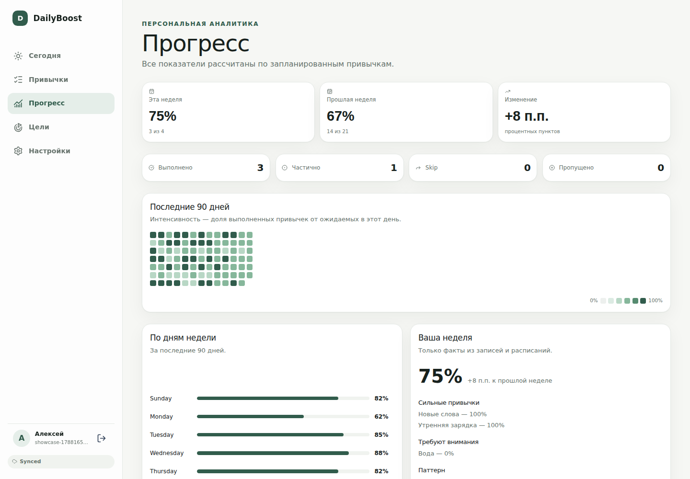
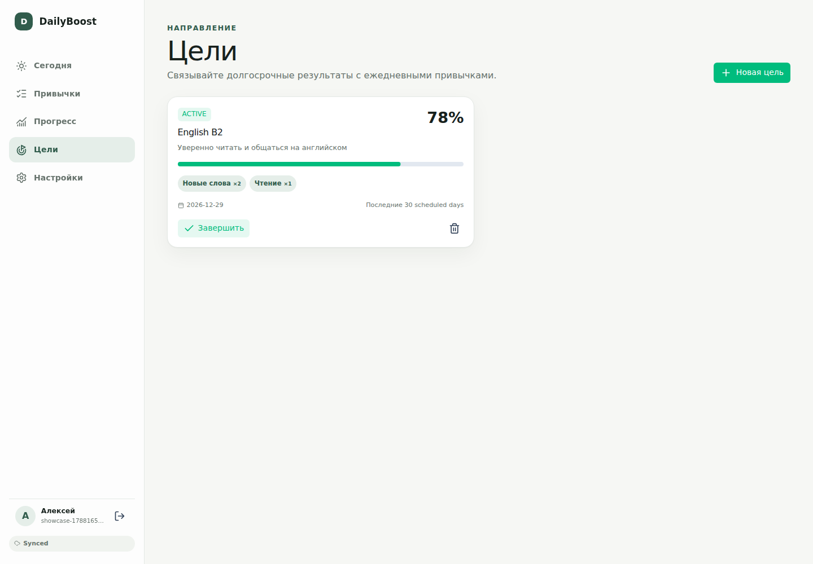
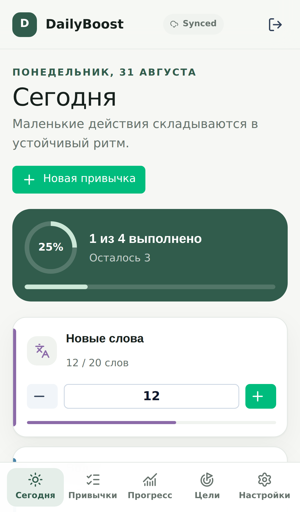
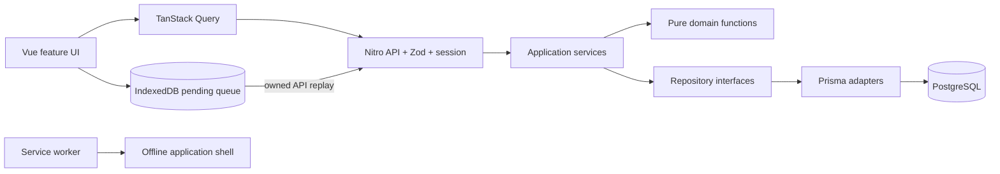

<p align="center">
  
</p>

<h1 align="center">DailyBoost</h1>

<p align="center">
  A calm, deterministic habit tracker for building a rhythm that survives real life.
</p>

<p align="center">
  <a href="https://github.com/minkinad/cboost/actions/workflows/ci.yml"></a>
  
  
  
</p>

DailyBoost is a production-oriented personal habit tracker with timezone-stable scheduling, four tracking modes, deterministic analytics, weighted goals, reminders, and controlled offline entry sync. PostgreSQL remains the canonical source of truth at every layer.

The product interface is Russian-first. Architecture decisions, domain rules, API contracts, and operational guidance live alongside the code.

## Product tour

### A focused plan for today

Boolean, count, duration, and quantity habits share one clear daily workflow, with partial progress and explicit skip actions.



### Analytics based on scheduled work

Weekly comparison, a completion-rate heatmap, weekday patterns, streaks, and weekly review are calculated from actual schedules and entries—never invented insights.



<table>
  <tr>
    <td width="68%">
      <strong>Goals tied to daily habits</strong><br><br>
      Weighted goal progress uses the completion rate of linked habits over their last 30 scheduled days.
      <br><br>
      
    </td>
    <td width="32%">
      <strong>Responsive by design</strong><br><br>
      The same core workflow stays usable on a phone, including offline queue visibility and accessible controls.
      <br><br>
      
    </td>
  </tr>
</table>

## What it does

- Tracks boolean, count, duration, and quantity habits.
- Supports everyday, selected-weekday, times-per-week, and interval schedules.
- Distinguishes pending, partial, completed, skipped, and calculated missed entries.
- Calculates per-habit streaks, best streaks, perfect-day streaks, and daily consistency.
- Organizes habits into owned categories and weighted long-term goals.
- Provides deterministic 7/30/90-day analytics, heatmaps, weekday analysis, and weekly review.
- Delivers multiple timezone-aware browser reminders per habit.
- Installs as a PWA and queues entry mutations offline in IndexedDB for controlled replay.
- Imports legacy localStorage data idempotently and supports habit archive/restore.

## Architecture

DailyBoost is a modular Nuxt/Nitro monolith. Vue renders application state; business rules remain in pure domain functions; application services orchestrate owned persistence through repository interfaces.



Calendar dates are `YYYY-MM-DD` values interpreted in the user's IANA timezone. Entry status, schedule membership, streaks, completion, expected entries, and analytics have canonical domain implementations rather than competing calculations in Vue components.

Read the deeper guides in [Architecture](docs/ARCHITECTURE.md), [Habit domain](docs/HABIT_DOMAIN.md), [Analytics](docs/ANALYTICS.md), and [Data model](docs/DATA_MODEL.md).

## Stack

| Area | Technology |
| --- | --- |
| Application | Nuxt 4, Vue 3, Nitro, TypeScript |
| Data | PostgreSQL 17, Prisma 7 |
| Client state and UI | TanStack Query, Nuxt UI, Zod |
| PWA | `@vite-pwa/nuxt`, Workbox, IndexedDB |
| Quality | Vitest, Nuxt Test Utils, Playwright, ESLint |

## Run locally

Prerequisites: Node.js 24.15.x and Docker.

```bash
cp .env.example .env
docker compose up -d postgres
npm ci
npm run db:migrate:deploy
npm run dev
```

Open `http://localhost:3000` and create an account. Use `npm run db:migrate` when authoring a migration; production and CI should use `npm run db:migrate:deploy`.

### Environment

| Variable | Required | Purpose |
| --- | --- | --- |
| `DATABASE_URL` | yes | PostgreSQL connection string |
| `NUXT_SESSION_PASSWORD` | yes | Stable random session-sealing secret of at least 32 characters |
| `APP_ORIGIN` | production | Exact public origin accepted by mutation origin checks |
| `NUXT_APP_BASE_URL` | no | Application base path; defaults to `/` |
| `NITRO_PRESET` | no | Nitro deployment preset; defaults to `node-server` |

Never commit a populated `.env`. Rotating `NUXT_SESSION_PASSWORD` invalidates existing sessions.

## Quality gate

```bash
npm run lint
npm run typecheck
npm run test
npm run build
npm run test:e2e
```

Vitest covers pure domains, application services, and PostgreSQL-backed integrations. Playwright covers authentication, habit tracking, analytics, goals, responsive UI, the PWA manifest, and offline replay. Failed CI runs retain screenshots and traces as artifacts.

## Recreate the screenshots

With a local production server running at `http://127.0.0.1:3000`:

```bash
npm run screenshots
```

The command creates a unique local showcase account, writes a deterministic 90-day dataset, and refreshes `docs/screenshots`. It refuses to seed a non-local host unless `ALLOW_REMOTE_SCREENSHOT_SEED=1` is set deliberately.

## Authentication and offline behavior

Email/password authentication uses scrypt-based password helpers and sealed HttpOnly cookie sessions. Every private API route enforces ownership server-side; cross-user identifiers return 404. Auth endpoints are rate-limited, unsafe same-origin browser requests are origin-checked, and production rejects weak session secrets.

Offline support is intentionally bounded: entry actions are queued, surfaced as `Saved offline`, replayed through the normal owned API, and removed only after server confirmation. Authentication, habit definitions, and analytics remain online-only. See [Authentication](docs/AUTH.md) and [Offline sync](docs/OFFLINE_SYNC.md).

## Deploy

DailyBoost requires a persistent Node server and PostgreSQL. Static generation is not supported because authenticated Nitro APIs are part of the application.

```bash
npm ci
npm run db:migrate:deploy
npm run build
node .output/server/index.mjs
```

Terminate TLS at the platform or reverse proxy, configure `APP_ORIGIN` with the public HTTPS origin, and retain PostgreSQL backups. The in-process auth limiter is intended for a single application instance; move it to shared edge infrastructure before horizontal scaling.

Operational and contributor details are in [Development](docs/DEVELOPMENT.md), [API](docs/API.md), [Migration](docs/MIGRATION.md), and the [User guide](docs/USER_GUIDE.md).
