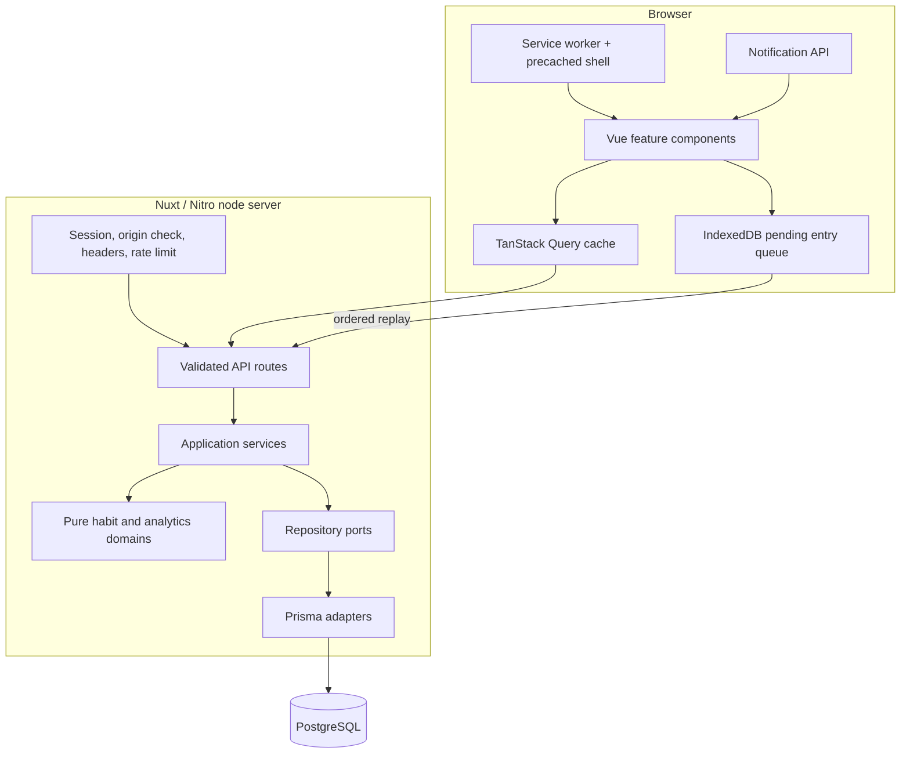
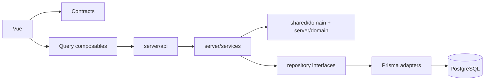

# DailyBoost architecture

DailyBoost is a server-rendered modular monolith. PostgreSQL is the canonical store; Nuxt provides the Vue application, Nitro HTTP boundary, and production Node server.

## Runtime overview

## Code boundaries

- `app/features`: feature UI, query composables, optimistic updates, and presentation only.
- `shared/domain` and `server/domain`: framework-independent business rules.
- `shared/schemas` and `shared/contracts`: Zod inputs and stable response DTOs shared by browser/server.
- `server/api`: authentication, parameter/body validation, HTTP status mapping.
- `server/services`: use-case orchestration, ownership, and conflicts.
- `server/repositories`: persistence interfaces.
- `server/repositories/prisma`: the only normal Prisma query implementation.
- `prisma/migrations`: reviewed database history; `db push` is not a deployment workflow.

The dependency direction is inward: pure domains do not import Nuxt, Vue, H3, Prisma, or browser APIs. Vue templates do not recalculate statuses, schedules, streaks, or analytics.

## Request and ownership model

Every private API route requires a sealed cookie session. Routes validate Zod input, then pass the authenticated `user.id` to a service. Owned queries filter by both resource ID and user ownership, directly or through the owning Habit; another user's valid UUID is indistinguishable from a missing resource and returns 404.

HabitSchedule is part of the Habit aggregate. HabitEntry and HabitReminder operations first prove Habit ownership. Categories and every habit linked to a Goal must belong to the same user.

## Client data flow

TanStack Query owns server-state caching. Mutations optimistically update the narrow habit cache and invalidate habit/analytics keys only where derived data can change. Normal habit endpoints include a bounded 120-day entry window. Long entry history uses date filters and cursor pagination. Analytics is aggregated by two server endpoints rather than one request per habit.

Only entry PUTs can be queued offline. Queue items retain the exact validated payload and deterministic habit/date identity, and are deleted after server confirmation. Details are in [OFFLINE_SYNC.md](OFFLINE_SYNC.md).

## PWA boundary

Workbox precaches versioned assets plus the offline shell. Authenticated rendered pages and API responses are deliberately not runtime-cached, preventing stale private payloads from being exposed after logout. The service worker handles installability and updates; PostgreSQL-backed data still requires the API except for explicitly queued mutations.

## Deployment

The supported target is a persistent Node server (`nuxt build`, then `.output/server/index.mjs`) with PostgreSQL. Static generation is unsupported because authenticated Nitro APIs are required. Production applies committed migrations before application rollout and supplies HTTPS, a stable session secret, and the exact `APP_ORIGIN`.
