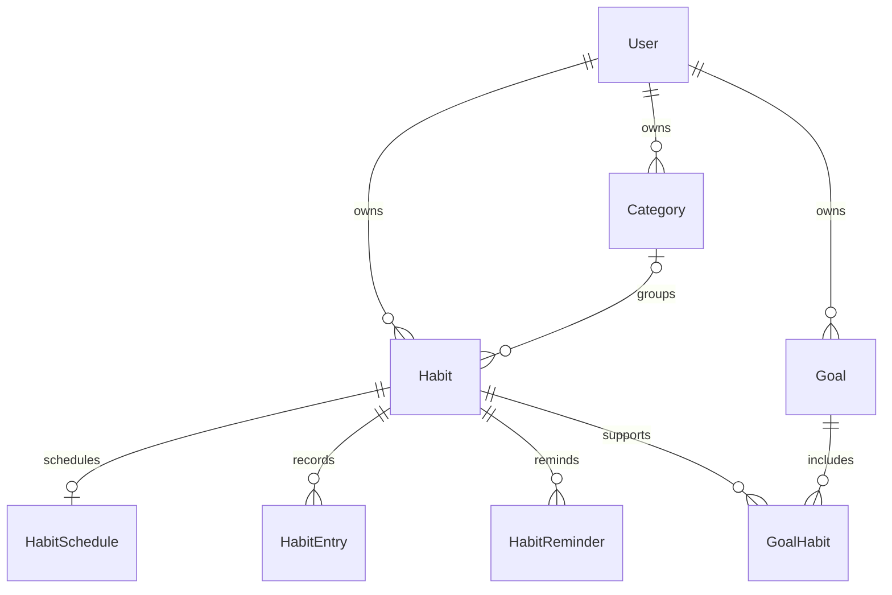

# Data model

## Relationships

## User

`User` stores normalized unique email, password hash, optional display name, IANA timezone, and timezone-aware timestamps. The timezone defines the stable current calendar date used across tracking and analytics.

## Habit aggregate

`Habit` belongs to one User, optionally to one Category, and owns one schedule, many entries, reminders, and goal links. `updatedAt` is an optimistic conflict token: habit PATCH may include `expectedUpdatedAt`, and stale writes return 409. Archive preserves dependent history; hard delete cascades it.

Tracking types are `BOOLEAN`, `COUNT`, `DURATION`, and `QUANTITY`. Numeric habits require a positive target and unit; Boolean habits have neither.

## HabitSchedule

Types are `EVERY_DAY`, `WEEKDAYS`, `TIMES_PER_WEEK`, and `INTERVAL`. Weekdays use `0..6` (Sunday through Saturday); interval days are anchored to `startDate`. PostgreSQL checks and Zod validation enforce schedule shape and date ordering. `habitId` is unique because the relation is one-to-one.

## HabitEntry

`date` is PostgreSQL `DATE` transported as `YYYY-MM-DD`; it is the user's calendar date, not a UTC instant. `(habitId, date)` is unique and is both the query index and idempotency invariant. Repeated `PUT` uses upsert and changes the same row.

`PENDING`, `PARTIAL`, and `COMPLETED` derive canonically from tracking type/value. `SKIPPED` is explicit. `MISSED` is calculated for past scheduled dates without completion and is not accepted as a manual write.

## HabitReminder

Each reminder stores its Habit, strict `HH:mm` wall-clock time, IANA timezone, enabled flag, and timestamps. `(habitId, time, timezone)` prevents duplicates. The `(habitId, enabled)` index supports owned reminder listing and active checks. Deleting the Habit cascades reminders.

## Category and goals

Category names are unique per user. Deleting one sets linked `Habit.categoryId` to null. Goal has `ACTIVE`, `COMPLETED`, or `ARCHIVED` status. `GoalHabit` is a many-to-many join with a positive decimal weight; its composite primary key prevents duplicate links.

## Index audit

Indexes match implemented queries:

| Resource | Index | Query pattern |
| --- | --- | --- |
| Habit | `(userId, archivedAt)` | active/archived lists for one user |
| HabitEntry | unique `(habitId, date)` | date upsert, range, descending cursor |
| HabitSchedule | unique `habitId` | aggregate include |
| Category | `(userId, createdAt)` and unique `(userId, name)` | owned ordered list/name uniqueness |
| Goal | `(userId, status)` | owned status list |
| GoalHabit | PK `(goalId, habitId)`, index `habitId` | goal expansion and reverse cleanup |
| HabitReminder | unique `(habitId, time, timezone)`, `(habitId, enabled)` | per-habit list and enabled filtering |

No standalone `Habit.userId` index is added because the composite prefix already supports user filtering. No redundant HabitEntry index is retained because its unique index supports the same left-prefix/date queries.
