# Offline synchronization

## Invariant

PostgreSQL and the owned API are canonical. IndexedDB contains only pending commands, never an independent habit database. Cached/optimistic UI is a temporary projection and server confirmation wins.

```mermaid
stateDiagram-v2
  [*] --> Saving: user changes entry online
  Saving --> Synced: API confirms
  Saving --> SavedOffline: connection fails / offline
  [*] --> SavedOffline: user changes entry offline
  SavedOffline --> Syncing: browser reconnects
  Syncing --> Synced: every PUT confirms; queue items removed
  Syncing --> SyncFailed: API/network failure; item retained
  SyncFailed --> Syncing: reconnect or explicit retry
```

The visible labels are exactly `Synced`, `Saving`, `Saved offline`, `Syncing`, and `Sync failed`. Failed sync remains visible and retryable.

## Queue scope and format

Version 1 queues only `PUT_HABIT_ENTRY` commands. Each contains habit ID, user calendar date, validated entry payload, creation time, attempts, and last error. Its deterministic key is `entry:<habitId>:<date>`; another change to the same habit/day replaces the pending payload while retaining queue position.

This coalescing matches the server unique key `(habitId, date)`. Server PUT is a Prisma upsert, so network retries are idempotent and do not create duplicate entries.

## Replay

On startup and the browser `online` event, commands replay in creation order through the normal authenticated API. A command is removed only after an HTTP success. The first failure is recorded and stops replay so ordering stays understandable. Successful flush invalidates habit and analytics query keys.

4xx responses are not silently treated as success. They remain queued and surface `Sync failed`; the user can retry after resolving session/domain changes. Habit definitions, archive/delete, reminders, categories, goals, and authentication are not offline mutations in this version.

## Conflicts

Habit definitions use `expectedUpdatedAt` and reject stale edits with 409. Habit entries use last queued/confirmed write for the unique habit/day row. CRDTs and parallel local databases are intentionally out of scope.

## Privacy and service worker

The service worker precaches only static assets and `offline.html`; authenticated rendered pages and API payloads are not runtime-cached. Signing out therefore does not leave a navigable cache of private server-rendered content. IndexedDB pending mutations remain in the browser profile until confirmed; users on shared devices should avoid recording sensitive notes offline.

## Known limits

- Closing/clearing the browser profile before replay loses unconfirmed commands.
- Multi-device updates to one entry resolve by the last server PUT; there is no entry version dialog.
- Background Sync API is not required; replay occurs while the application is opened/reconnected.
- Offline read access is limited to the application shell and already-rendered optimistic state.
